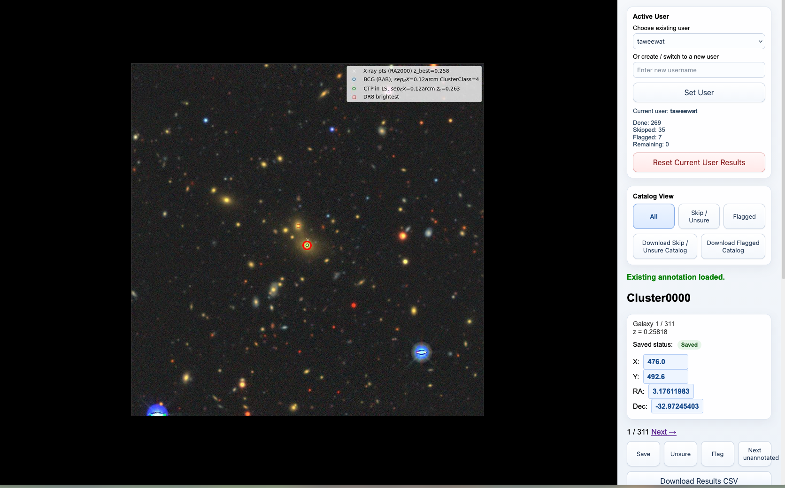

# BCG Picker

BCG Picker is a lightweight Flask app for interactively identifying the Brightest Cluster Galaxy (BCG) in Legacy Survey image cutouts.

The app now uses a **CSV-first workflow** for normal use:

- one shared catalog CSV
- one results CSV per user
- one generated combined CSV for team review

This makes the workflow easier to inspect, share, and use across different machines.

## Screenshot



## Features

- Interactive image viewer for cluster cutouts
- Click-to-mark BCG selection
- Pixel-to-RA/Dec conversion from the selected marker
- Marker placement that stays aligned while zooming
- Per-user saved annotations with simple username switching
- Skip/unsure and flagged states
- Active-user progress tracking
- Jump to the next unannotated cluster for the current user
- Filter the catalog view to `All`, `Skip / Unsure`, or `Flagged`
- Download the current user's full results CSV at any time
- Download reviewer worklists for the current user's skipped or flagged objects
- Import another reviewer's results CSV
- Generate and download combined results across all reviewers
- Review cross-user disagreements with overlaid markers on the same image
- Upload a custom catalog and reset back to the full default catalog

## Requirements

- Python 3
- Flask

Install from the repo manifest:

```bash
pip install -r requirements.txt
```

Or install Flask directly:

```bash
pip install flask
```

## Run the App

Start the app with:

```bash
python app.py
```

Then open:

```text
http://127.0.0.1:5000/
```

## Project Structure

```text
bcg-picker/
├── app.py
├── csv_store.py
├── data/
│   ├── catalog.csv
│   ├── results/
│   ├── imports/
│   └── combined/
├── images/
├── screenshots/
├── static/
│   ├── script.js
│   └── style.css
├── templates/
│   ├── admin_review.html
│   ├── admin_review_cluster.html
│   └── index.html
├── tests/
│   └── test_app.py
├── requirements.txt
└── README.md
```

## Core Data Files

### Shared catalog

```text
data/catalog.csv
```

Required columns:

```text
cluster,image,ra,dec,redshift,pixscale
```

Example:

```csv
cluster,image,ra,dec,redshift,pixscale
Cluster0001,cluster000.jpg,3.17611983,-32.97124401,0.10,0.262
Cluster0002,cluster001.jpg,12.33456000,-41.12345000,0.56,0.262
```

### Per-user results

Each user is stored in a separate file:

```text
data/results/<sanitized_username>_results.csv
```

Example:

```text
data/results/john_smith_results.csv
```

Stored columns:

```text
username,cluster,image,x,y,ra,dec,skipped,flagged,updated_at
```

### Combined results

Generated on demand:

```text
data/combined/all_results.csv
```

### Imported reviewer files

Imported reviewer CSVs are copied into:

```text
data/imports/
```

## Main Workflow

1. Open the app.
2. Choose an existing user from the dropdown, or enter a new username.
3. Navigate to a cluster.
4. Zoom if needed using the mouse wheel.
5. Click the galaxy to place or move the marker.
6. Press `S` or click `Save`.
7. Press `N` or click `Unsure` to skip an uncertain object.
8. Press `F` or click `Flag` to mark an object for later review.
9. Press `U` or click `Next unannotated` to jump to the next remaining cluster for that user.
10. Use `Download Results CSV` anytime to export the current user's current annotations.
11. Use `Reset Current User Results` to clear that user's saved work for the current catalog and start over.

Each user sees only their own saved positions, skip states, flagged states, and progress counts.

## Catalog Filters

The `Catalog View` panel includes:

- `All`
- `Skip / Unsure`
- `Flagged`

These filters are based on the **active user's own annotations**.

Typical use:

- use `All` for the main pass
- use `Skip / Unsure` to revisit difficult objects
- use `Flagged` to revisit interesting objects

If a filter has no matching objects for the current user, the app shows an empty-state message instead of a broken page.

## Results Export

`Download Results CSV` exports the active user’s file in the import-ready format:

```text
username,cluster,image,x,y,ra,dec,skipped,flagged,updated_at
```

The filename is based on the sanitized username, for example:

```text
alice_results.csv
```

Saving an annotation for the same user and cluster overwrites that user’s previous row for that object.

## Reviewer Worklist Export

The `Catalog View` panel also includes:

- `Download Skip / Unsure Catalog`
- `Download Flagged Catalog`

These buttons export smaller catalog CSV files for the **current user's** skipped or flagged objects. This is useful when:

- one reviewer should redo the full catalog
- another reviewer should only review your skipped objects
- another reviewer should only review your flagged objects

Example filenames:

```text
taweewat_skipped_catalog.csv
taweewat_flagged_catalog.csv
```

Another reviewer can load one of these files through `Load Custom Catalog` and work only on that subset.

## Import Reviewer Results

The admin panel includes an **Import Reviewer Results CSV** tool.

Expected behavior:

- validates the uploaded CSV columns
- requires exactly one username per uploaded file
- refuses to overwrite an existing local user file unless you confirm replacement

This is the main workflow for bringing collaborator results from another machine into your local copy.

## Combined Results and Admin Review

The admin panel includes:

- `Download All Results CSV`
- `Review All Results`

The combined export is generated from all files in `data/results/` and downloaded as:

```text
all_results.csv
```

The review page groups annotations by cluster, shows each user's saved position or state, and highlights clusters where users disagree.

Clicking a reviewed cluster opens a detail page that:

- displays the cluster image
- overlays all non-skipped user markers on the same image
- assigns a different color to each user marker
- shows a legend so you can match colors to users

## Disagreement Threshold

For review purposes, two marked positions are treated as agreement when their separation is `<= 1.5` arcsec.

The comparison uses:

```text
sqrt((delta_RA)^2 + (delta_Dec)^2)
```

with `RA` and `Dec` both in degrees. This approximation is appropriate here because the separations are very small.

If one person skips, one person flags, or one person marks while another skips/flags, that cluster is treated as disagreement.

## Team Workflow

### For collaborators

1. Pull or install the repo on your machine.
2. Choose your username in the app.
3. Annotate clusters.
4. Click `Download Results CSV`.
5. Send that CSV back to the project lead.

### For the project lead

1. Receive collaborator CSV files.
2. Import them through `Import Reviewer Results CSV`.
3. Download `All Results CSV` when needed.
4. Use `Review All Results` to inspect agreement/disagreement.
5. Export skip-only or flagged-only catalogs for follow-up review.

## Custom Catalogs

You can upload a custom CSV catalog as long as it uses the same column names as the default catalog and references images present in `images/`.

Use `Use Full Catalog` in the UI to restore the default dataset.

`data/uploaded_catalog.csv` is treated as a local runtime file and is ignored by Git.

## Navigation

Open a cluster by index:

```text
http://127.0.0.1:5000/0
```

Open a cluster by cluster name:

```text
http://127.0.0.1:5000/cluster/Cluster0001
```

## Keyboard Shortcuts

| Shortcut | Action |
| --- | --- |
| Click image | Place or move marker |
| `S` | Save annotation |
| `N` | Skip / unsure |
| `F` | Flag interesting object |
| `U` | Jump to next unannotated cluster |
| `←` | Previous cluster |
| `→` | Next cluster |
| `1` | Reset zoom to 1× |
| Mouse wheel | Zoom in / out |

## Tests

Run the lightweight test suite with:

```bash
python -m unittest discover -s tests
```

You can also do a quick syntax check with:

```bash
python -m py_compile app.py csv_store.py tests/test_app.py
```

## Notes

- The app is intended for local use right now.
- Images are never modified by the app.
- RA/Dec is derived from the stored marker position and the catalog center coordinates.
- The current user must be set before saving, skipping, flagging, jumping, resetting results, or downloading user-specific files.
- Runtime data folders such as `data/results/`, `data/imports/`, and `data/combined/` are ignored by Git.
